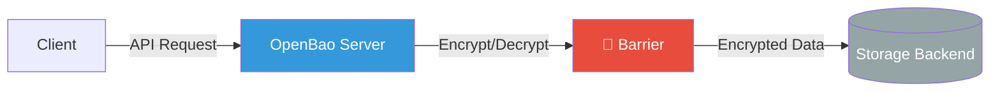
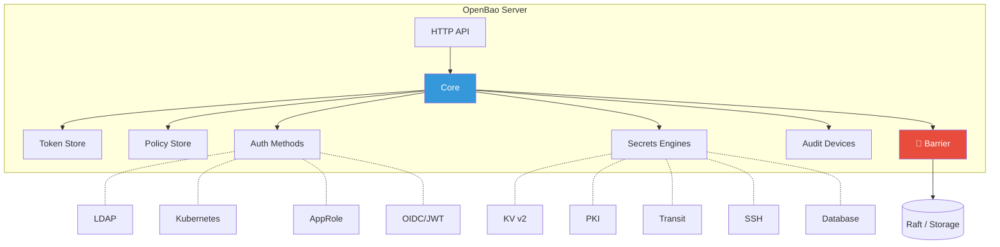
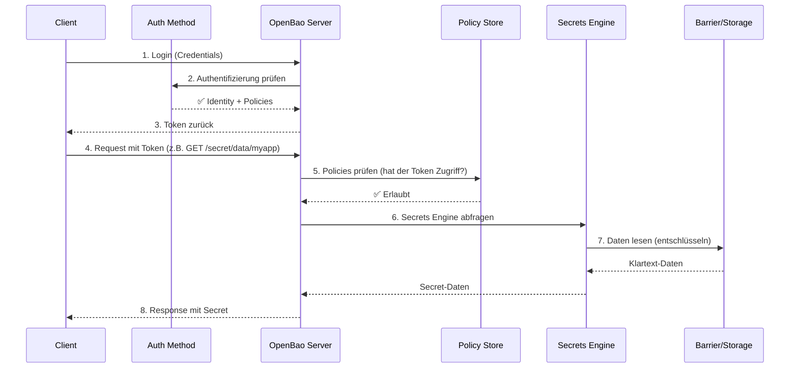
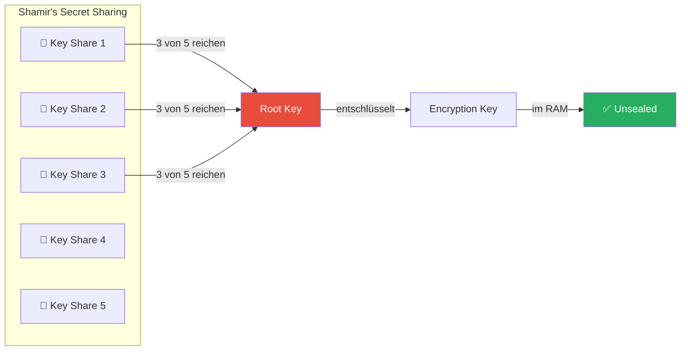
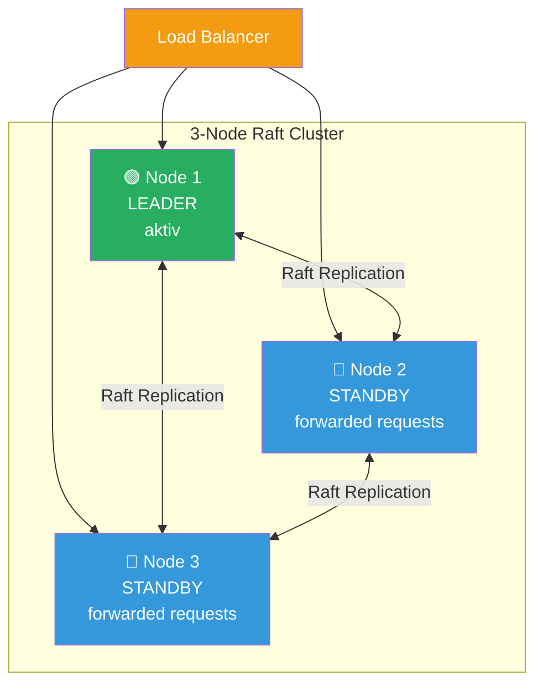
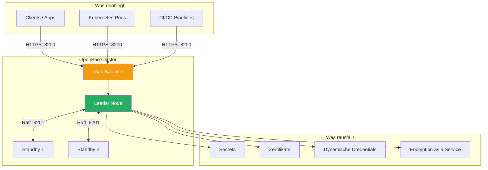

# OpenBao – Architektur-Überblick

OpenBao ist ein Open-Source Fork von HashiCorp Vault (MPL 2.0 Lizenz) zur zentralen Verwaltung von Secrets, Zertifikaten und Verschlüsselungskeys. Hier ein pragmatischer Überblick, wie das Ding unter der Haube funktioniert.

---

## Kernkonzept: Die Barrier

OpenBao verschlüsselt **alles**, bevor es auf die Platte geschrieben wird. Die sogenannte *Barrier* (Verschlüsselungsschicht) trennt die vertrauenswürdige Innenwelt von OpenBao vom untrusted Storage Backend.

> **Faustregel:** Wer Zugriff auf das Storage Backend hat, sieht nur verschlüsselte Blobs – niemals Klartext.

---

## Hauptkomponenten

| Komponente | Was macht das? |
|---|---|
| **Core** | Zentrale Steuerung – nimmt Requests entgegen, prüft Policies, leitet an die richtige Engine weiter |
| **Barrier** | Ver-/Entschlüsselung aller Daten vor dem Schreiben ins Storage |
| **Token Store** | Verwaltet Tokens nach erfolgreicher Authentifizierung (inkl. Policies, TTLs, Renewals) |
| **Policy Store** | Speichert ACL-Policies (deny-by-default, pfadbasiert) |
| **Auth Methods** | Pluggable Authentifizierung – wer bist du? (z.B. Kubernetes, OIDC, AppRole, LDAP) |
| **Secrets Engines** | Pluggable Backends, gemountet auf Pfaden – hier liegen/entstehen die eigentlichen Secrets |
| **Audit Devices** | Logging jedes einzelnen Requests (wer hat wann was gemacht?) |

---

## Request-Lebenszyklus

So läuft ein typischer Request durch OpenBao:

---

## Seal / Unseal Mechanismus

OpenBao startet im **Sealed**-Zustand – es kann nichts lesen oder schreiben. Erst durch das Unseal-Verfahren wird der Encryption Key im RAM verfügbar.

**Zwei Varianten:**

| Variante | Wie funktioniert's? |
|---|---|
| **Shamir Seal** | Root Key wird in N Teile gesplittet, M davon werden zum Unseal benötigt (z.B. 3 von 5) |
| **Auto Unseal** | Root Key wird durch ein externes KMS geschützt (z.B. AWS KMS, Azure Key Vault, Transit-Engine eines anderen OpenBao) – automatisches Unseal beim Start |

---

## HA-Cluster mit Integrated Storage (Raft)

Für Produktion läuft OpenBao als Cluster mit **Integrated Storage (Raft)**. Raft ist ein Konsensus-Protokoll – alle Daten werden automatisch zwischen den Nodes repliziert.

**Wichtige Punkte:**

- **1 Leader** bearbeitet alle Schreiboperationen und repliziert an die Follower
- **Standby-Nodes** leiten Requests per Forwarding an den Leader weiter
- Ein 3-Node-Cluster toleriert den Ausfall von **1 Node** (Quorum: 2 von 3)
- Ein 5-Node-Cluster toleriert den Ausfall von **2 Nodes** (Quorum: 3 von 5)
- Netzwerk-Latenz zwischen Nodes sollte **< 8 ms** sein
- Performance ist primär durch **Disk I/O und Netzwerk-Latenz** begrenzt

---

## Ressourcen-Empfehlung pro Node (3-Node-Cluster)

OpenBao gibt keine eigenen Hardware-Empfehlungen, basiert aber architektonisch auf HashiCorp Vault. Die folgenden Werte orientieren sich an bewährten Praxiswerten:

| Sizing | CPU | RAM | Disk | Anmerkung |
|---|---|---|---|---|
| **Minimum** | 2 vCPUs | 4–8 GB | 20 GB SSD | Nur für Dev/Test oder sehr geringe Last |
| **Empfohlen (Produktion)** | 4 vCPUs | 8–16 GB | 50–100 GB SSD | Standard-Workload, bis zu ein paar hundert RPS |
| **Groß (High-Traffic)** | 8 vCPUs | 32 GB | 100+ GB SSD | Viele dynamische Secrets, Transit-Encryption, hoher Durchsatz |

### Hinweise

- **SSD ist Pflicht** – Raft mit BoltDB ist für SSDs optimiert. Spinning Disks führen zu massiven Performance-Einbrüchen
- **Burstable Instanzen vermeiden** (z.B. AWS `t2`/`t3`) – unter Dauerlast bricht die Performance ein
- **Audit-Logs** idealerweise auf eine **separate Disk** schreiben
- RAM-Verbrauch steigt mit der Anzahl aktiver Leases, Tokens und gemounteter Engines
- Für einen typischen **3-Node-Cluster in der Cloud**: 3× eine VM mit **4 vCPUs, 8 GB RAM, 50 GB SSD** ist ein solider Start

### Beispiel Cloud-Instanztypen

| Provider | Instanztyp | Specs |
|---|---|---|
| **AWS** | `m5.xlarge` | 4 vCPU, 16 GB RAM |
| **DigitalOcean** | `s-4vcpu-8gb` | 4 vCPU, 8 GB RAM |
| **Azure** | `Standard_D4s_v3` | 4 vCPU, 16 GB RAM |
| **GCP** | `e2-standard-4` | 4 vCPU, 16 GB RAM |
| **Hetzner** | `CPX31` | 4 vCPU, 8 GB RAM |

---

## Netzwerk-Ports

| Port | Protokoll | Zweck |
|---|---|---|
| `8200` | TCP | API & UI (Client-Zugriff) |
| `8201` | TCP | Cluster-Kommunikation (Raft, Request Forwarding) |

Beide Ports müssen zwischen den Cluster-Nodes erreichbar sein. Port `8200` wird zusätzlich für Clients / Load Balancer geöffnet.

---

## Zusammenfassung

**TL;DR:** OpenBao ist ein verschlüsselter Tresor für Secrets. Alles wird durch eine Barrier verschlüsselt, bevor es gespeichert wird. Authentication und Authorization sind strikt getrennt. Im HA-Modus läuft ein Raft-Cluster mit einem Leader und Standby-Nodes. Für einen produktiven 3-Node-Cluster reichen 3× 4 vCPUs, 8 GB RAM, 50 GB SSD als Startpunkt.
